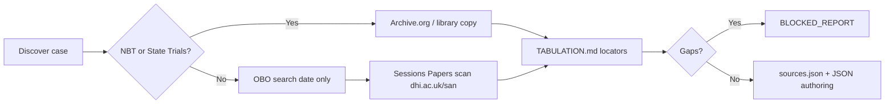

# Case Archive Survey — SimJury Phase 4+

**Role:** Content Curator research deliverable  
**Authority:** `CASE_HARNESS.md`, `PHASE4-PLAN.md`, `PILOT-SPEC.md`  
**Status:** Living document — update when new archives or clearance decisions land

This survey lists **broad, comprehensive archives** of historical legal cases that may feed future SimJury content. It is a **discovery and sourcing map**, not a case-selection decision log. Every candidate still requires the full harness workflow (inclusion I-1–I-8, exclusion E-1–E-7, tabulation, clearance).

---

## 1. How to use this document

| Step | Action |
|------|--------|
| 1 | Search archives below for jury trials with rich witness testimony |
| 2 | Run `CASE_HARNESS.md` inclusion checklist and exclusion scan |
| 3 | Confirm **source class** per v3 §8.2 / `PHASE4-PLAN.md` — especially **E-4 / EX-5** (no Old Bailey Online text without licence) |
| 4 | Verify publication date for PD (UK: generally pre-1926; US varies) |
| 5 | Log decision: `pjm decision "Case candidate: <name> — included/excluded because …"` |

**SimJury Phase 4 floors** (historical): 6–9 witnesses, ≥60 testimony blocks, 8–12 exhibits, 3–5 episodes, ≥4 distinct sources, `BALANCE.md`.

---

## 2. Archive tiers (summary)

| Tier | Archive | Scale | SimJury fit | Licence / harness note |
|------|---------|-------|-------------|------------------------|
| **A** | Notable British Trials (NBT) | ~83 volumes, 1586–1959 | **Best** — edited verbatim trials, one case per book | Many on [Archive.org](https://archive.org/search?query=notable%20british%20trials); PD status **per volume** — verify before transcribing |
| **A** | Sessions Papers / CCC scans (DHI) | 1674–1913 proceedings, page images | **Best** for independent transcription | Class **(b)** — PD images, not OBO text; e.g. `https://www.dhi.ac.uk/san/ccc/` |
| **A** | Parliamentary / official reports | Inquiry reports, pardons, compensation | **Primary** for truth-file and ruling layers | Class **(c)** / **(e)** — Hansard, Cd. papers, NLI |
| **B** | Howell / Cobbett State Trials | 34 vols, 1163–1820 | Strong for pre-CCC celebrated trials | PD on [Archive.org](https://archive.org/search?query=complete%20collection%20state%20trials%20howell); also [statutes.org.uk](https://www.statutes.org.uk/) |
| **B** | British Newspaper Archive | 130M+ pages | Supplementary testimony / procedure | Class **(d)**; subscription; pre-1926 articles PD |
| **B** | National Archives (Kew) | CRIM, PCOM, TS 36, DPP 4 | Selected verbatim transcripts | On-site / record copying; not bulk-downloadable |
| **C** | Old Bailey Online | ~197,752 trials, 1674–1913 | **Discovery only** | **E-4 / EX-5** — do not copy OBO XML/text without commercial licence |
| **C** | Digital Panopticon / London Lives | Convict lives, linked OBA | Context, not full trial authoring | Biographical; use to find names/dates then source from (b) or NBT |
| **C** | Connected Histories | Federated UK 18th–19th c. search | Discovery | Points to OBA and other corpora — same OBO restriction |
| **D** | Famous Trials (Douglas Linder) | ~80 curated trials | US-heavy; good pedagogy | Educational excerpts — not a transcript archive; check terms |
| **D** | Welsh Journals Online / NLW crime guides | Welsh assizes & crime | Regional UK supplement | Mixed PD; verify per item |

**Recommendation:** Treat **NBT + Sessions Papers scans + Hansard/Parliamentary papers** as the primary UK pipeline for Phase 4–5. Use **Old Bailey Online** only to **locate** trials, then transcribe from class (b) images or NBT.

---

## 3. Tier A archives (primary)

### 3.1 Notable British Trials (William Hodge & Co.)

- **URL (catalog):** [noumenal.com NBT pamphlet (1954)](http://www.noumenal.com/marc/nbt.html)  
- **URL (full text):** [Archive.org search: "Notable British Trials"](https://archive.org/search?query=notable%20british%20trials)  
- **Scope:** ~83 volumes (1905–1959); Scottish (green, pre-1921) and English (red) series merged as NBT from 1921. Each volume: scholarly introduction + edited verbatim trial + appendices (appeals, official reports).  
- **Why it fits:** Trial-focused (not thriller); multiple witnesses; appeal/inquiry material often included; strong for `BALANCE.md`.  
- **Harness:** Verify PD per volume (pre-1926 publication generally safe; 1922+ volumes need date check). **Do not assume** 1950s volumes are PD.  
- **Known SimJury use:** C-001 *Adolf Beck* — Watson ed. 1922, [Archive.org](https://archive.org/details/in.ernet.dli.2015.31183).

### 3.2 Sessions Papers / Central Criminal Court (DHI digitisation)

- **URL:** `https://www.dhi.ac.uk/san/` (CCC and assize page images)  
- **Example (Beck 1896):** `https://www.dhi.ac.uk/san/ccc/18960224/`  
- **Scope:** Original printed proceedings — PD **page images** for independent transcription.  
- **Class:** **(b)** per `PHASE4-PLAN.md` — explicitly **not** OBO rekeyed text.  
- **Limitation:** Not always verbatim; edited for publication; sexual-offence trials often truncated from late 18th c.

### 3.3 Parliamentary & official records

| Source | URL / access | Use |
|--------|----------------|-----|
| Hansard (historic) | `https://api.parliament.uk/historic-hansard/` | Pardons, compensation, committee presentation |
| National Library of Ireland | `https://catalogue.nli.ie/` | Parliamentary papers (e.g. Cd. 2315 Beck inquiry) |
| UK Parliament publications | `https://www.parliament.uk/` | Command papers, committee reports class **(c)** |
| The National Archives guides | [Criminal trials at assizes](https://www.nationalarchives.gov.uk/help-with-your-research/research-guides/criminal-trials-assize-courts-1559-1971/) | Locators for TS 36, DPP 4 transcripts |

---

## 4. Tier B archives (secondary / deep sourcing)

### 4.1 Howell / Cobbett State Trials

- **Scope:** 34 volumes, trials 1163–1820 (treason, murder, sedition, celebrated causes).  
- **URL:** [Archive.org — Howell State Trials](https://archive.org/search?query=complete%20collection%20state%20trials%20howell)  
- **Fit:** Pre-CCC English/Scottish jury trials with lengthy records (e.g. Mary Queen of Scots, Warren Hastings-era cases). Older language; longer adaptation effort.

### 4.2 British Newspaper Archive

- **URL:** `https://www.britishnewspaperarchive.co.uk/`  
- **Scope:** 130M+ newspaper pages; strong 19th–20th c. UK coverage.  
- **Class:** **(d)** — supplementary; cross-check identification, procedure, daily testimony summaries.  
- **Cost:** Subscription; pre-1926 content generally PD.

### 4.3 The National Archives (Kew)

- **CRIM** — criminal case files (not usually full transcripts)  
- **TS 36** — Treasury Solicitor transcripts (1812–1963)  
- **DPP 4** — selected criminal trial transcripts (1846–1958)  
- **Use:** When NBT/Sessions Papers lack depth; requires on-site or paid record copying.

### 4.4 Welsh & regional

- **National Library of Wales** — crime and punishment research guides  
- **Welsh Journals Online** — regional trial reporting  
- **Fit:** Extends beyond London/Edinburgh; same harness rules apply.

---

## 5. Tier C — discovery only or context

### 5.1 Old Bailey Online (OBO)

- **URL:** `https://www.oldbaileyonline.org/`  
- **Scale:** 197,752 trials; 127M words; API available (`/static/API.jsp`).  
- **Harness:** **E-4** — text is double-rekeyed transcription under licence. **Do not paste OBO text into case JSON** without commercial licence (`LICENSING.md` / EX-5).  
- **Allowed use:** Search by offence, verdict, date, name → obtain trial date → pull **Sessions Papers images** or **NBT** volume.

### 5.2 Digital Panopticon / London Lives

- **URLs:** `https://www.digitalpanopticon.org/`, `https://www.londonlives.org/`  
- **Use:** Convict careers, linked OBA references, 1780–1925 — excellent for truth-file aftermath, not primary testimony authoring.

### 5.3 Connected Histories

- **URL:** `https://www.connectedhistories.org/`  
- **Use:** Single search across OBA and related corpora — same OBO copying restriction.

---

## 6. Tier D — international & curated (lower priority for UK pilot)

| Archive | URL | Notes |
|---------|-----|-------|
| Famous Trials | `https://www.famous-trials.com/` | Douglas Linder; ~80 trials; strong US (Lizzie Borden, Scopes, etc.); edited excerpts |
| Avalon Project (Yale) | `https://avalon.law.yale.edu/` | Historical legal documents; some trial material |
| Library of Congress | `https://www.loc.gov/` | Scattered trial pamphlets |
| HathiTrust / Google Books | Various | Duplicate of Archive.org for many NBT/State Trials volumes |

Westhaven jurisdiction is UK-flavoured; US cases are viable only with equivalent harness clearance and PD sourcing.

---

## 7. Harness-filtered NBT candidates

Filtered from the [1954 NBT catalog](http://www.noumenal.com/marc/nbt.html) against **I-4** (no sexual violence, child victims, graphic injury), jury-trial pedagogy, and likely Phase 4 floor feasibility. **Not approved** — research shortlist only.

### 7.1 Strong fit (recommended for deeper scoping)

| Case | NBT vol. / year | Trial year | Jury themes | PD / source path | Notes |
|------|-----------------|------------|-------------|------------------|-------|
| **R v. Adolf Beck** | 1922 (Watson) | 1896 | Identification, prior conviction, expert handwriting, miscarriage | S-01 Cd. 2315 + S-02 Sessions + NBT | **C-001 selected** — in progress |
| **Oscar Slater** | Roughead, 4th ed. | 1909 | Identification-only prosecution, Scottish verdict split, later quashed | NBT + Scottish records | Miscarriage parallel to Beck |
| **Harold Greenwood** | Duke, 1920 | 1920 | Poisoning circumstantial, expert toxicology, **acquittal** | NBT + newspapers | Strong defence balance |
| **Madeleine Smith** | Jesse, 3rd ed. | 1857 | Circumstantial poison, letters, social class | NBT + Scottish papers | **Acquitted** — prosecution-heavy balance work |
| **Adelaide Bartlett** | Hall, 1886 | 1886 | Poison mystery, expert medical clash, **acquittal** | NBT + OBA date → Sessions | Famous "not guilty" |
| **H. R. Armstrong** | Young, 1922 | 1922 | Arsenic, solicitor accused, circumstantial | NBT | Lord Darling's last murder trial |
| **Hawley Harvey Crippen** | Young, 2nd ed. | 1910 | Disappearance, flight, forensic pathology, identification | NBT + Sessions 1910 | Very famous; ensure I-4 (dismemberment in facts — may need careful moulding) |
| **Frederick Bywaters & Edith Thompson** | Young, 1922 | 1922 | Letter evidence, joint enterprise, no eyewitness | NBT | Thompson hanged — emotional weight |
| **George Joseph Smith** | Watson, 1915 | 1915 | "Brides in the bath" — novel method, expert testimony | NBT | Multiple victims — truth-file only for non-trial deaths |
| **Dr. Smethurst** | Parry, 1859 | 1859 | Poison + pardon; medical ethics dispute | NBT | Official pardon narrative strong for truth file |
| **A. J. Monson** | More, 1893 | 1893 | Scottish "not proven"; insurance motive; shooting | NBT | Ambiguous verdict pedagogy |
| **Robert Wood** | Hogarth, 1907 | 1907 | Identification, accused testifies, **acquittal** | NBT | Camden Town murder — post-1898 accused evidence |
| **Alfred Arthur Rouse** | Normanton, 1931 | 1931 | "Blazing car" — identity of victim, circumstantial | NBT | 1930s — verify PD for 1931 ed. |
| **Alma Rattenbury & Stoner** | Jesse, 1935 | 1935 | Joint trial, witness-box drama, age disparity | NBT | Adultery theme — screen for I-4 tone |
| **Mrs. Maybrick** | Irving, 1889 | 1889 | Poison circumstantial, questionable conviction | NBT | Commuted sentence — balance debate |
| **Eugene Aram** | Watson, 1750 | 1759 | Historical circumstantial murder | NBT / State Trials | Older prose; adaptation cost |
| **Charles Peace** | Shore, 1879 | 1879 | Identification across aliases, burglary + murder | NBT | Multiple proceedings in one volume |

### 7.2 Moderate fit (usable with extra clearance or condensation)

| Case | Concern | Why still interesting |
|------|---------|----------------------|
| **William Palmer** (1856) | Three-judge trial; poisoning | Classic circumstantial jury case |
| **Trial of the Seddons** (1912) | Arsenic lodger death | Financial motive; wife acquitted |
| **Steinie Morrison** (1911) | Mutilation facts | Circumstantial London murder |
| **John Dickman** (1910) | Railway murder; weak ID | Circumstantial + bad accused testimony |
| **Royal Mail Case / Kylsant** (1931) | Company fraud not murder | White-collar jury trial — atypical charge type |
| **City of Glasgow Bank Directors** (1879) | Fraud not violence | Multiple directors — witness scale |

### 7.3 Exclude from SimJury (harness blockers)

| Case | Blocker |
|------|---------|
| Burke and Hare | Graphic dismemberment; invention risk |
| Oscar Wilde trials | Sexual offences (I-4) |
| Thomas Neill Cream | Sex work / sexual violence context (I-4) |
| Christie / Evans | Child victims; miscarriage of justice but I-4 |
| Peter Griffiths, Nodder, Straffen, Jeannie Donald | Child victims (I-4) |
| Neville Heath | Sexual violence, graphic (I-4) |
| War Crimes Trials series | Out of scope; non-jury military tribunals; atrocity content |
| Abraham Thornton | Sexual assault murder (I-4) |
| Katherine Nairn | Incest charge (I-4) |

---

## 8. Sourcing workflow (per case)

1. **Discover** — NBT catalog, OBO keyword search, or State Trials index.  
2. **Acquire** — Prefer NBT PDF or Sessions Papers images; add Hansard/Parliamentary row for inquiries.  
3. **Tabulate** — Every witness theme → `source_id` + page locator.  
4. **Exclude OBO text** unless operator adds `LICENSING.md`.  
5. **Balance** — `BALANCE.md` before merge.

---

## 9. Internet Archive quick searches

Pre-built queries for bulk discovery:

| Query | URL |
|-------|-----|
| Notable British Trials | `https://archive.org/search?query=notable%20british%20trials` |
| William Hodge trial | `https://archive.org/search?query=creator%3A%22William%20Hodge%22%20trial` |
| State Trials Howell | `https://archive.org/search?query=state%20trials%20howell` |
| Central Criminal Court 1896 | `https://archive.org/search?query=central%20criminal%20court%201896` |
| Old Bailey proceedings print | `https://archive.org/search?query=old%20bailey%20proceedings` |

---

## 10. Recommended next cases (after C-001 Beck)

Priority order for Content Curator scoping — **subject to operator approval**:

1. **Oscar Slater** — Scottish identification miscarriage; complements Beck.  
2. **Harold Greenwood** — Acquittal on poison; strong defence story.  
3. **Adelaide Bartlett** — Acquittal; expert battle.  
4. **H. R. Armstrong** — English poison circumstantial.  
5. **Madeleine Smith** — Scottish circumstantial letters case.

Each requires a fresh EX-1 source audit (NBT volume + supplementary class b/d/e) before skeleton JSON.

**Completed:** See `CASE_EX1_AUDITS.md` — per-case source matrices for all §7.1–7.3 survey cases (23 eligible + 12 blocked).

---

## 11. References

- `CASE_HARNESS.md` — inclusion, exclusion, phase floors  
- `PHASE4-PLAN.md` — source classes (a)–(e), EX-5  
- `CASE_EX1_AUDITS.md` — EX-1 access audits for all survey cases  
- `pilot/src/main/resources/cases/c_001/EX-1-HANDOFF.md` — worked example for Beck  
- NBT catalog: http://www.noumenal.com/marc/nbt.html  
- Old Bailey Online: https://www.oldbaileyonline.org/  
- Sessions Papers: https://www.dhi.ac.uk/san/  
- TNA criminal trials guide: https://www.nationalarchives.gov.uk/help-with-your-research/research-guides/criminal-trials-assize-courts-1559-1971/

---

*Document version: 2026-07-07 — initial survey*
