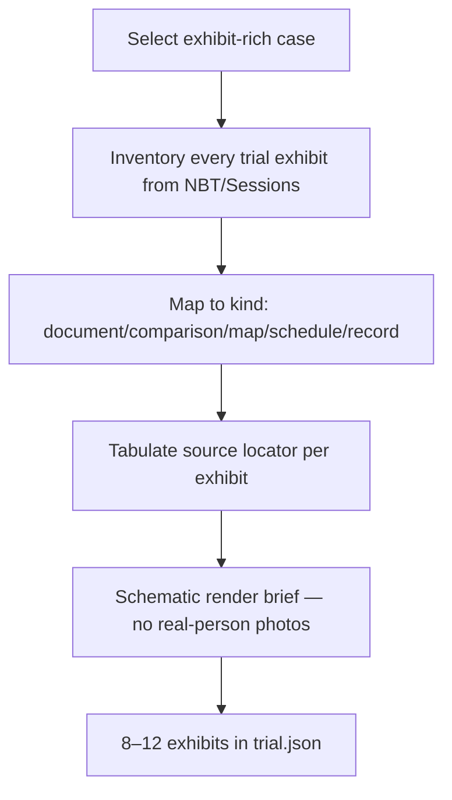

# Multimedia Case Candidates — SimJury Exhibit-Rich Trials

**Role:** Content Curator research  
**Authority:** `CASE_HARNESS.md`, `archive/simjury-build-spec-v3.md` §4 (imagery), §8.6.3 (exhibits)  
**Companion:** `CASE_ARCHIVE_SURVEY.md`, `CASE_EX1_AUDITS.md`  
**Status:** 2026-07-07

This document expands the case shortlist toward trials where **documentary and visual evidence** naturally supports SimJury’s exhibit UI — handwriting charts, letters, maps, comparison diagrams, schedules, and physical artefacts described in the record.

---

## 1. What “multimedia evidence” means in SimJury

The pilot schema stores exhibits as structured JSON (`kind`, `title`, `text`, prosecution/defence claims, `source`). Phase 4+ targets **8–12 exhibits** per historical case.

**v3 imagery rule (still governing design intent):**

> No photographs of real people. Exhibits are typeset documents, schematic line-art, and period-style typography rendered from bundled vector/PNG assets you create.

So “multimedia” here means **cases rich in evidence that maps to exhibit kinds**, not cases where you can drop trial photos into the APK unchanged.

### Exhibit kinds (v3 / Beck blueprint)

| Kind | Render approach | Example |
|------|-----------------|---------|
| `document` | Period-typeset facsimile | Letter, cheque, signed undertaking, insurance policy |
| `comparison` | Schematic line chart | Handwriting overlay, fingerprint ridge chart, skull superimposition diagram |
| `schedule` | Table / timeline | Complainant encounter dates, chronology tension |
| `map` | Line-art plan | Crime scene, house plan, railway carriage layout |
| `record` | Official form | Identification parade sheet, police ledger, court register |

**Authoring workflow:** Source locators → tabulate → transcribe exhibit text → commission **schematic** `render_asset` (future `exhibits.json` field) from PD descriptions in NBT/Sessions Papers — never copy OBO text (EX-5).

---

## 2. Scoring key

| Column | Meaning |
|--------|---------|
| **MM score** | Multimedia richness for SimJury (1–5): count and variety of exhibit types |
| **Harness** | Eligible / Review / Blocked per `CASE_HARNESS.md` |
| **Sources** | NBT / Sessions / official archive |

**MM types:** HW handwriting · FP fingerprint · PH photo/superimposition (schematic only) · LT letters · MAP plan · PHY physical artefact · TOX toxicology chart · FIN financial doc · ID identification record · RLY transport ephemera

---

## 3. Tier A — Best multimedia + harness fit (priority)

Cases with **≥4 distinct exhibit types** and strong jury pedagogy. Ordered by multimedia richness.

| Rank | Case | Trial | MM | Types | Key exhibits (player-facing) | Harness | Primary sources |
|------|------|-------|---:|-------|------------------------------|---------|-----------------|
| 1 | **R v. Adolf Beck** | CCC 1896 | 5 | HW, LT, FIN, ID, PHY | Handwriting comparison chart; fraud lists; cheques; clothing lists; ID parade record; chronology schedule | **C-001** | [NBT](https://archive.org/details/in.ernet.dli.2015.31183); [Sessions](https://www.dhi.ac.uk/san/ccc/18960224/); Cd. 2315 |
| 2 | **Stratton brothers** (Deptford / Mask murders) | OBA 1905 | 5 | FP, PH, PHY | Fingerprint enlargement vs thumbprint; cash-box; mask (stocking-top); Collins ridge chart | Eligible | Trial pamphlets; [OBO discovery](https://www.oldbaileyonline.org/); fingerprint literature; Crime Museum refs in press |
| 3 | **Madeleine Smith** | Edinburgh 1857 | 5 | LT, TOX, PHY, FIN | Complete love letters; arsenic bottle; cocoa/coffee cups; post-mortem schedule | Eligible | [NBT](https://archive.org/details/trialofmadeleine0000jess); NRS trial productions (letters, bottle) |
| 4 | **Sir Roger Tichborne** (perjury) | QB 1873–74 | 5 | LT, HW, PH, FIN | Handwriting; claimant photos (schematic silhouettes); shipping records; weight charts | Eligible* | [Trial at bar vols](https://archive.org/details/trialatbarofsirr02ortouoft); massive documentary record |
| 5 | **Buck Ruxton** | Manchester 1936 | 5 | PH, FP, MAP, TOX | Skull–portrait superimposition diagram; fingerprint from body; Moffat map; maggot timeline chart | **Review** (I-4 mutilation) | [NBT](https://archive.org/details/in.ernet.dli.2015.173614); [NLM forensic gallery](https://www.nlm.nih.gov/exhibition/visibleproofs/galleries/cases/ruxton.html) |
| 6 | **Hawley Harvey Crippen** | OBA 1910 | 4 | MAP, TOX, PHY, RLY | Cellar plan; remains sketch; wireless arrest timeline; ship cabin diagram | Eligible* | [NBT](https://archive.org/details/trialofhawleyhar00cripiala); [Sessions](https://www.dhi.ac.uk/san/ccc/19101011/) |
| 7 | **George Joseph Smith** | CCC 1915 | 4 | MAP, FIN, PHY | Bath diagram; life-insurance policies; marriage certificates; bathroom measurements | Eligible | [NBT](https://archive.org/details/trialofgeorgejos015895mbp) |
| 8 | **Oscar Slater** | Edinburgh 1909 | 4 | ID, FIN, LT | Pawn ticket; jewellery list; identification chart; alibi timeline | Eligible | [NBT](https://archive.org/details/trialofoscarslat00slatuoft); Hansard 1927–28 |
| 9 | **Frederick Bywaters & Edith Thompson** | OBA 1922 | 4 | LT, MAP | Thompson letters (read in court); relationship timeline; crime scene map | Eligible | [NBT](https://archive.org/details/trialoffrederick0000bywa) |
| 10 | **Browne & Kennedy** (Gutteridge murder) | CCC 1928 | 4 | FP, PHY, RLY | Cartridge comparison microscopy chart; stolen car records; ballistics schematic | Eligible | [NBT](https://archive.org/details/in.ernet.dli.2015.173616) |
| 11 | **Franz Muller** | OBA 1864 | 4 | PHY, RLY, ID | Hat, stick, bag from Hackney compartment; victim injuries chart; train timetable | Eligible | [NBT](https://archive.org/details/trialoffranzmull00mulliala) |
| 12 | **Robert Wood** | OBA 1907 | 4 | LT, ID, MAP | *Rising Sun* postcard; identification parade; Camden Town map | Eligible | [Sessions](https://www.dhi.ac.uk/san/ccc/19071210/); NBT library |
| 13 | **H. R. Armstrong** | Hereford 1922 | 4 | TOX, FIN, MAP | Arsenic quantity chart; exhumation report; solicitor’s ledger; garden supply receipts | Eligible | [NBT](https://archive.org/details/TrialOfHerbertRowseArmstrong) |
| 14 | **Mrs. Maybrick** | Liverpool 1889 | 4 | TOX, PHY, LT | Soiled linens; fly-paper arsenic extraction; husband’s diary; pharmacy records | Eligible | [NBT](https://archive.org/details/in.ernet.dli.2015.221940) |
| 15 | **Dr. Smethurst** | OBA 1859 | 4 | TOX, LT, FIN | Arsenic analysis tables; bigamy certificate; medical ethics correspondence | Eligible | [Sessions](https://www.dhi.ac.uk/san/ccc/18590704/); NLI NBT |

\*Tichborne: civil perjury trial (not murder) — still jury trial, enormous documentary weight. Crippen: mould remains — clinical tone only.

---

## 4. Tier B — Strong multimedia, good fit

| Case | Trial | MM | Types | Key exhibits | Harness | Sources |
|------|-------|---:|-------|--------------|---------|---------|
| **Alfred Arthur Rouse** | Northampton 1930 | 4 | PHY, ID, MAP | Burned car diagram; victim identity chart; Hardingstone road map | Eligible | [NBT](https://archive.org/details/in.ernet.dli.2015.173609) |
| **William Palmer** | Stafford/CCC 1856 | 4 | TOX, FIN, LT | Toxicology tables; betting debts; Cook’s will; three-judge procedure note | Eligible | [NBT Knott 1912](https://archive.org/details/trialofwilliampa00palmiala); [Sessions](https://www.dhi.ac.uk/san/ccc/18560514/) |
| **Trial of the Seddons** | OBA 1912 | 3 | TOX, FIN, MAP | Exhumation arsenic chart; annuity deed; lodger room plan | Eligible | [NBT](https://archive.org/details/trialofseddons00seddiala); [Sessions](https://www.dhi.ac.uk/san/ccc/19120227/) |
| **Adelaide Bartlett** | OBA 1886 | 3 | TOX, LT | Medical bottle schedule; Bartlett’s account; Dyson witness statement | Eligible | [NBT](https://archive.org/details/in.ernet.dli.2015.173664); [Sessions](https://www.dhi.ac.uk/san/ccc/18860405/) |
| **John Dickman** | Newcastle 1910 | 3 | RLY, FIN, ID | Railway carriage layout; £370 wages bag; ticket stubs; circumstantial timeline | Eligible | [NBT](https://archive.org/details/trialofjohnalexa0000dick) |
| **A. J. Monson** | Edinburgh 1893 | 3 | FIN, MAP, PHY | Insurance policies (£20k); Ardlamont estate map; sporting-gun diagram | Eligible | [NBT](https://archive.org/details/trialofajmonson00mons) |
| **Harold Greenwood** | Carmarthen 1920 | 3 | TOX, LT | Exhumation toxicology; heart-disease certificate vs arsenic chart | Eligible | [NBT](https://archive.org/details/bwb_KU-773-114) |
| **Charles Peace** | Leeds/OBA 1878–79 | 3 | ID, PHY, MAP | Disguise sketches; burglary tools; Dyson shooting plan | Eligible | [NBT](https://archive.org/details/trialsofcharlesf0000wtsh) |
| **Royal Mail / Lord Kylsant** | OBA 1931 | 3 | FIN, LT | Prospectuses; “cooked” balance sheets; shareholder letters | Eligible | [NBT](https://archive.org/details/royalmailcaserex0000unse) |
| **City of Glasgow Bank directors** | Edinburgh 1879 | 3 | FIN, LT | Falsified balance sheets; director circulars; note issue schedule | Eligible | [NBT](https://archive.org/details/trialofcityofgla00city) |
| **Baccarat Case** (Gordon-Cumming v. Wilson) | High Court 1891 | 3 | LT, FIN | Signed undertaking not to play; score-card diagrams; aristocratic witness list | Eligible | [Baccarat case](https://archive.org/details/baccaratcasegord0000gord) |
| **William Gardiner** (Peasenhall) | Ipswich 1902–03 | 3 | MAP, ID, LT | Footprint casts; village map; chapel timetable | Eligible | NBT (Henderson 1903); assize pamphlets |
| **Samuel Herbert Dougal** | Chelmsford 1903 | 3 | MAP, ID, PHY | Moat Farm plan; bullet; identification of decomposed body | Eligible | NBT (Jesse 1903) |
| **Alma Rattenbury & Stoner** | OBA 1935 | 3 | LT, MAP | Echo advertisement; Bournemouth house plan; cocaine defence chart | Eligible* | [NBT](https://archive.org/details/trialofalmavicto015893mbp) |
| **Steinie Morrison** | OBA 1911 | 2 | LT, MAP | Belle Elmore murder scene; restaurant receipts | Review (I-4 mutilation) | [NBT](https://archive.org/details/trialofsteiniemo0000hfle); [Sessions](https://www.dhi.ac.uk/san/ccc/19110228/) |

---

## 5. Tier C — Forensic landmark, harness or scope caveats

High multimedia value but blocked, out of phase, or need extra clearance.

| Case | MM highlight | Why deferred |
|------|--------------|--------------|
| **Peter Griffiths** (1948) | Mass fingerprint comparison (Blackburn bottle) | I-4 child victim |
| **Christie / Evans** (Rillington Place) | Confession documents; miscarriage exhibits | I-4 child victims |
| **Buck Ruxton** (if I-4 fails) | Defining forensic photography case | Graphic dismemberment facts |
| **Burke & Hare** | Wellcome trial plates + plan | I-4 graphic; dismemberment |
| **Thomas Neill Cream** | Poison purchase ledger | I-4 sexual violence context |
| **Neville Heath** | Whip / hotel register | I-4 sexual violence |
| **Dreyfus** (France 1899) | Bordereau handwriting | Non-UK; French records |
| **Leopold & Loeb** (US 1924) | Nietzsche, chisel, glasses | US; Famous Trials excerpts only |

---

## 6. Tier D — Broader archive fishing (discovery)

Use these corpora to find **additional** exhibit-rich trials beyond NBT:

| Archive | Multimedia angle | Search strategy |
|---------|------------------|-----------------|
| **NBT series** (~83 vols) | Most volumes **ILLUSTRATED** — plates of scenes, documents, portraits (redraw as schematics) | [Archive.org NBT](https://archive.org/search?query=notable%20british%20trials) |
| **Old Bailey Online** | Discovery → date → Sessions scan | Keyword: “handwriting,” “plan,” “photograph,” “fingerprint” |
| **DHI Sessions Papers** | Page images of exhibits as printed in proceedings | `https://www.dhi.ac.uk/san/ccc/` |
| **National Records of Scotland** | Physical **productions** in Scottish trials (bottles, letters, weapons) | JC26 case papers; Madeleine Smith, Slater |
| **Wellcome Collection** | Trial pamphlets with lithograph plates | e.g. Burke trial [works/m6jfbnx3](https://wellcomecollection.org/works/m6jfbnx3) |
| **British Newspaper Archive** | Sketches of exhibits shown to jury | Illustrated police-court columns pre-1926 |
| **National Library of Medicine** | Forensic photography history | [Visible Proofs — Ruxton](https://www.nlm.nih.gov/exhibition/visibleproofs/galleries/cases/ruxton.html) |
| **TNA Kew** | TS 36 / DPP 4 verbatim transcripts with exhibit lists | Selected celebrated trials |

---

## 7. Recommended pipeline (multimedia-first)



**After Beck (C-001), best multimedia sequencing:**

1. **Madeleine Smith** — letters + physical productions (NRS); iconic documentary trial  
2. **Stratton brothers** — fingerprint comparison (first in England); teach forensic jury evidence  
3. **George Joseph Smith** — bath diagram + insurance docs; novel method  
4. **Oscar Slater** — pawn ticket / ID; pairs with Beck miscarriage theme  
5. **Robert Wood** — postcard + acquittal; compact exhibit set  
6. **Browne & Kennedy** — ballistics comparison; 1920s forensic  

---

## 8. Exhibit inventory template (per case)

Copy when scoping a new case:

```markdown
## Exhibit inventory — [Case name]

| ID | Title | kind | MM source in record | Source ID | Locator | Render note |
|----|-------|------|---------------------|-----------|---------|-------------|
| X-01 | … | comparison | Handwriting chart in NBT p.… | S-01 | p.147 | Schematic overlay, no portrait |
```

---

## 9. Cross-reference to EX-1 audits

Full source access paths for harness-eligible cases: `CASE_EX1_AUDITS.md`.  
This document adds the **multimedia dimension** — use both when prioritising backlog.

---

## 10. References

- `archive/simjury-build-spec-v3.md` §4 (imagery), §8.6.3 (Beck exhibits), exhibit `kind` enum  
- `PHASE4-PLAN.md` — Beck exhibit list X-01..X-10  
- `CASE_HARNESS.md` — I-4, phase floors (8–12 exhibits)  
- Stratton fingerprint: [Wikipedia / contemporary accounts](https://en.wikipedia.org/wiki/Stratton_Brothers_case)  
- Madeleine Smith productions: [NRS / Scotsman](https://www.scotsman.com/whats-on/arts-and-entertainment/evidence-from-infamous-19th-century-murder-trial-on-show-844311)  

---

*Document version: 2026-07-07*
