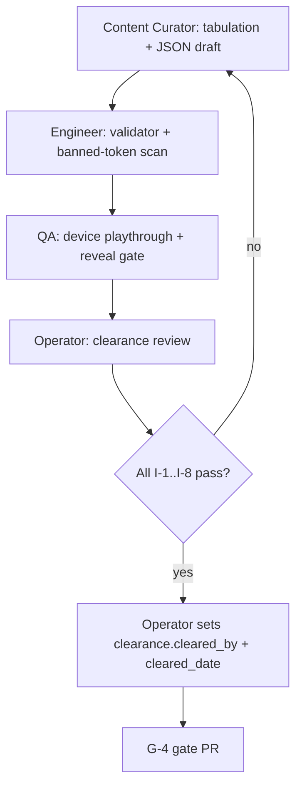

# Phase 4 Planning — Case 001 (R v. Adolf Beck)

**Status:** Planning only — no case JSON authored on this branch.  
**Authority:** `ROADMAP.md` (Phase 4), `CASE_HARNESS.md`, `PILOT-SPEC.md`.  
**v3 reference (Section 8.6 only):** `archive/simjury-build-spec-v3.md` — content blueprint, **not** quantity authority.

**Play title (v3):** *The List*  
**Reveal title:** R v. Adolf Beck, Central Criminal Court, London, 1896  
**Asset path:** `pilot/src/main/resources/cases/c_001/` (+ mirrored `pilot/app/src/main/assets/cases/c_001/` for Android)

---

## 1. Scope and goals (Gate G-4)

### Phase 4 goal (ROADMAP)

Author Case 001 (Beck) **per the harness**, not per raw v3 Section 10 quantities. Deliver a condensed, historically faithful trial the player can read on the Phase 3 Android shell (episodes → diary → vote → reveal).

### Gate G-4 criteria

| Criterion | Evidence |
|-----------|----------|
| Full playthrough on device | QA sign-off: C-001 end-to-end on Android emulator/release build |
| `BALANCE.md` complete | Good-faith prosecution and defence arguments (Section 8 below) |
| Human clearance complete | `case.json → clearance` booleans true; `cleared_by` set by operator (not placeholder) |

### In scope for Phase 4

- EX-1 source acquisition and `sources.json` (operator handoff)
- `TABULATION.md` — every trial item traced to a source locator before JSON
- Condensed Beck trial assets: `case.json`, `trial.json`, `pseudonyms.json`, `truth_file.json`, `sources.json`
- Schema extensions required by harness/v3 clearance and adaptations (small Engineer PR)
- Harness phase floors (Section 3)
- `BALANCE.md` + balance validation
- Banned-token (F-4) scan green for Beck real names pre-reveal
- `CaseIntegrity*` tests extended for C-001 floors
- projectmem decisions for case selection, source classes, condensation choices

### Explicitly out of scope until G-4 passes

See Section 9.

---

## 2. Beck case source acquisition (EX-1 operator handoff)

Per v3 Section 31 **EX-1**: the actual text of approved sources must be supplied or access-confirmed by the **human operator** before content authoring begins. Agents produce a **BLOCKED REPORT** if any required document is unavailable — never author from memory (F-1).

### Approved source classes (v3 §8.2)

| Class | Document | Role in C-001 | Default path |
|-------|----------|-----------------|--------------|
| **(a)** | Old Bailey Online transcription | Optional — **only** with commercial licence (EX-5) | **Exclude** unless operator adds `LICENSING.md` |
| **(b)** | Sessions Papers / Proceedings 1896 (page images) | Trial testimony, exhibits | Transcribe independently from PD images |
| **(c)** | Report of the Committee of Inquiry into the Case of Mr Adolf Beck (Parl. Paper Cd. 2315, 1904–05) | Richest source: verbatim evidence extracts, **ruling 8.6.5**, inquiry context for truth file | **Primary** — operator must supply PDF or confirmed access |
| **(d)** | Contemporaneous newspaper reports (pre-1926) | Supplementary testimony / procedural colour | PD scans or transcriptions |
| **(e)** | Pardon notice, parliamentary compensation record | Truth-file aftermath only (not trial phase — AD-5) | PD official record |

### EX-1 handoff checklist (operator PR / dated note in `DECISIONS.md`)

Operator confirms for each row: **obtained** | **access confirmed** | **substitute within class**.

| # | Document needed | Covers (witness / exhibit / theme) | Minimum locator |
|---|-----------------|-----------------------------------|-----------------|
| 1 | Committee of Inquiry report (c) | W-01..W-09 tabulation, ruling 8.6.5, D-04, truth file | pp. covering 1896 trial evidence |
| 2 | 1896 Sessions Papers (b) | Complainant selection, W-08 accused, exhibits | Trial day proceedings |
| 3 | Newspaper report (d) | Cross-check identification procedure | At least one 1896 trial report |
| 4 | Pardon / compensation (e) | Truth file legal & aftermath layers | Official notice text |
| 5 | EX-5 decision | OBO licence yes/no | Recorded in `LICENSING.md` or "no OBO text" |

### BLOCKED REPORT template (if handoff incomplete)

```markdown
# BLOCKED REPORT — C-001 source acquisition

## Missing documents
| Document | Class | Needed for | Acceptable substitute |
|----------|-------|------------|----------------------|

## Impact
- Cannot tabulate rows: …
- Cannot author witnesses: …

## Operator action required
[Bibliographic detail sufficient for human retrieval]
```

**Gate rule:** No testimony JSON until BLOCKED REPORT is resolved and `sources.json` entries exist for every `S-xx` cited in tabulation.

---

## 3. Harness floors vs v3 floors

`CASE_HARNESS.md` §4 sets **pilot-appropriate floors** for Phase 4. v3 Section 10 (110-block minimum, 9 witnesses exact, 40 juror lines each) applies only when Phase 5 deliberation is in scope.

| Item | C-000 (pilot) | **Phase 4 harness** (`CASE_HARNESS.md` §4) | v3 §8.6 / §10 (deferred) |
|------|---------------|---------------------------------------------|---------------------------|
| Witnesses | 2 | **6–9** | 9 exact roster |
| Testimony blocks | ≥ 8 | **≥ 60** | ≥ 110 |
| Exhibits | 2 | **8–12** | 12–16 |
| Episodes | 1 | **3–5** | 5 (60–90 min target) |
| Contradictions (ground truth) | 1 | **≥ 3** | ≥ 3 (K-01..K-03 classes) |
| Sources (distinct) | ≥ 2 | **≥ 4** | ≥ 4 |
| Juror lines | 0 | ≥ 20 per juror* | ≥ 40 per juror |
| Directions | 1 (pilot) | **4–5** (burden, ID, expert, prior-allegation, optional deadlock) | D-01..D-05 |
| Counsel speeches | — | Condensed / optional at G-4 | Word-count floors §8.6.1 |

\* **Reconciliation:** `ROADMAP.md` places full deliberation in Phase 5. Proposed decision: **juror authored lines are out of scope for G-4**; harness juror floor is satisfied at G-5 when `:deliberation-core` is wired. Log via `pjm decision` before first juror PR.

**Authoring rule (harness §4):** *Never import v3 Section 10 floors until Phase 5 deliberation is in scope.*

**Condensation rule (v3 AD-1):** May merge repetitive complainants and cut speeches; every removal of prosecution-favourable or defence-favourable material must be **balanced** and noted in `truth_file.json → adaptations[]`.

---

## 4. Proposed C-001 JSON structure

Mirror C-000 layout. New files marked **(new)**.

```
pilot/src/main/resources/cases/c_001/
├── case.json              # metadata, charge, clearance, episode_ids
├── trial.json             # episodes, witnesses, exhibits, directions
├── pseudonyms.json        # P-01..P-n per v3 PS-1..PS-6
├── truth_file.json        # layers, pseudonym_reveal, adaptations
├── sources.json           # S-01..S-n (≥4)
├── TABULATION.md          # mandatory before testimony JSON
└── BALANCE.md             # G-4 deliverable (new)
```

Android mirror: `pilot/app/src/main/assets/cases/c_001/` (same files).

### 4.1 `case.json`

| Field | Beck value |
|-------|------------|
| `id` | `C-001` |
| `title_play` | `The List` |
| `title_reveal` | `R v. Adolf Beck` |
| `synthetic` | `false` (set explicitly in JSON — do not omit) |
| `schema_version` | `pilot-1` (extend when clearance model lands) |
| `charge` | Obtaining jewellery by false pretences — four elements per v3 §8.6 |
| `episode_ids` | `["E-01","E-02","E-03","E-04"]` (proposed 4) |
| `estimated_minutes` | 25–40 (harness-sized; below v3 60–90) |
| `clearance` | v3 §8.3 object — booleans true; `cleared_by` pending until operator sign-off |
| `content_notes` | Identification-heavy fraud trial; no graphic content |

### 4.2 Episodes (proposed 4)

| Episode | Title (working) | Content focus | Approx. items |
|---------|-----------------|---------------|---------------|
| **E-01** | The method | Crown opening (summarised); W-01, W-02 complainants; 2 exhibits | ~18 blocks + 2 X |
| **E-02** | Many accounts | W-03, W-04 complainants; W-05 police identifications; 3 exhibits | ~18 blocks + 3 X |
| **E-03** | Handwriting and history | W-06 expert; W-07 prior-conviction constable + **ruling moment**; D-02–D-04 | ~16 blocks + 3 X + directions |
| **E-04** | The accused speaks | W-08 accused; W-09 defence (if sourced); D-01; remaining exhibits; chronology tension exhibit | ~17 blocks + 2 X |

Episode count satisfies harness **3–5**; reading order follows v3 AD-4 (no reordering of evidential sequence).

### 4.3 Witness roster (target 8–9)

Condense ~10 historical complainants to **four** per v3 §8.6.2; select the four with richest surviving testimony in class (c) then (b).

| ID | Role | Called by | Target blocks (exam + cross) | Notes |
|----|------|-----------|------------------------------|-------|
| W-01..W-04 | Complainant witnesses | prosecution | 5+4 each (36 total) | Preserve ID weaknesses: brief contact, delay, street ID |
| W-05 | Police officer (identifications) | prosecution | 4+4 | Procedure per record |
| W-06 | Handwriting expert | prosecution | 4+3 | Certainty per source — do not soften |
| W-07 | Retired constable (18 years earlier) | prosecution | 3+3 | Cross + judge ruling §8.6.5 |
| W-08 | Accused | defence | 5+5 | Denial, South America residence |
| W-09 | Defence witness | defence | 2+2 | **STOP if record lacks support** (v3 §8.6.2) |

**Harness floor:** 8 witnesses, **71** testimony blocks (≥ 60). v3 per-witness minimums are **not** binding at Phase 4.

### 4.4 Exhibits (target 10)

| ID | Exhibit | Sourced from |
|----|---------|--------------|
| X-01..X-02 | Clothing lists (period-typeset) | (b)/(c) |
| X-03 | Handwriting comparison chart | (c) |
| X-04 | Cheque(s) | (b)/(c) |
| X-05 | Schedule of complainants' encounters (interval dates per PS-5) | (c) |
| X-06 | Identification-parade record | (b)/(c) |
| X-07 | Chronology exhibit (one genuine tension in record) | (c) |
| X-08..X-10 | Supporting documents as tabulation demands | (b)/(c)/(d) |

Harness range **8–12**; v3 requires 12–16 — **do not chase v3 exhibit ceiling at G-4**.

### 4.5 Directions

| ID | Topic | Phase 4 |
|----|-------|---------|
| D-01 | Burden & standard | Required |
| D-02 | Identification caution (Westhaven; `adaptation_note` for pre-modern trial) | Required |
| D-03 | Expert evidence | Required |
| D-04 | Prior-allegation / ruling reflection (§8.6.5) | Required |
| D-05 | Deadlock | Optional stub until Phase 5 deliberation |

### 4.6 Ground truth (≥ 3 contradictions)

| ID | Class | Theme (anchor in sourced blocks) |
|----|-------|----------------------------------|
| K-01 | `real_decisive` | Identification conditions vs asserted certainty |
| K-02 | `real_immaterial` | Per record |
| K-03 | `illusory` | Per record |

Populate `valid_uses` when schema supports ground-truth objects (Engineer PR).

### 4.7 `truth_file.json`

Four layers per v3 §8.6.8 (condensed for harness):

1. **Legal** — jury convicted; penal servitude; no appeal court  
2. **Factual** — later wrongful-conviction arc (1904 offender, pardon, compensation) — **sources (e) and (c) only**  
3. **Unknown** — ≥ 5 entries (blocked alibi, ID defects, expert error, etc.)  
4. **Aftermath** — inquiry, Court of Criminal Appeal consequence, fixed closing line + `pseudonym_reveal`

**AD-5:** No 1904 inquiry findings in trial-phase JSON.

### 4.8 Tabulation approach

Follow `CASE_HARNESS.md` §5 Steps A–C:

1. **Select** — log `pjm decision "Case 001 Beck — included because …"`  
2. **Source acquisition** — EX-1 handoff complete  
3. **Tabulate** — one row per element/theme **before** any `T-W*` / `X-*` ID is written  
4. Empty locator cells → gap → BLOCKED  
5. Witness condensation choices documented in tabulation Notes column  
6. Content Curator signs tabulation complete in PR checklist  

Example row shape (from C-000 pattern):

```markdown
| Fraud method (gentleman, list, cheque) | S-01 | Inquiry p.42 | summarised | W-01 examination |
```

---

## 5. PR breakdown (≤ 400 lines each)

Suggested order. Each case-content PR includes harness checklist (`CASE_HARNESS.md` §7).

| PR | Title | Scope | Depends on |
|----|-------|-------|------------|
| **P4-0** | `PHASE4-PLAN.md` + ROADMAP cross-link | This document only | — |
| **P4-1** | EX-1 handoff / `sources.json` scaffold | Operator confirms documents; `S-01..S-04` entries; BLOCKED REPORT if needed | P4-0 |
| **P4-2** | Schema: clearance + multi-episode | Extend `:case-model`; add clearance/adaptations; **remove pilot-only 1-episode check** in `CaseValidator.kt` (lines 41–43) and update/remove the matching test in `CaseIntegrityTest.kt` (lines 40–43) so 3–5 episodes pass; tests | P4-0 |
| **P4-3** | C-001 skeleton + `TABULATION.md` | `case.json`, `trial.json` with minimal valid stub (one episode, at least two witnesses and four testimony blocks to satisfy current validator floors) so `CaseIntegrity*` stays green; `pseudonyms.json` keys only; tabulation rows for all themes | P4-1 |
| **P4-4** | Episodes E-01–E-02 testimony | W-01..W-02, partial exhibits | P4-3 tabulation |
| **P4-5** | Episodes E-02–E-03 testimony | W-03..W-05, ID exhibits | P4-4 |
| **P4-6** | Episode E-03: expert + ruling | W-06, W-07, D-02–D-04 | P4-5 |
| **P4-7** | Episode E-04: accused + defence | W-08, W-09 (or BLOCKED), D-01 | P4-6 |
| **P4-8** | Remaining exhibits + ground truth | X-08..X-10, K-01..K-03 | P4-4..P4-7 |
| **P4-9** | `truth_file.json` + reveal layers | Post-verdict only; AD-5 enforced | P4-1 sources (e) |
| **P4-10** | `BALANCE.md` + balance test | §8 below | P4-4..P4-9 |
| **P4-11** | Android asset sync + case selector | Mirror to `pilot/app/src/main/assets/cases/c_001/`; load `c_001` | P4-4..P4-9 |
| **P4-12** | **G-4 gate** | Full playthrough evidence; clearance sign-off; CI green | All above |

**Line-budget guidance:** Split any PR approaching 400 lines at witness or episode boundaries. Testimony text dominates line count — one episode per PR is the default cap.

---

## 6. Human clearance workflow

Per v3 §8.3 and harness §2 (I-1–I-4).



### `clearance` object (embedded in `case.json`)

| Field | G-4 requirement |
|-------|-----------------|
| `all_participants_deceased` | `true` |
| `matter_finally_closed` | `true` |
| `no_live_review_prospect` | `true` |
| `sources_public_domain_or_licensed` | `true` |
| `no_sexual_offence_content` | `true` |
| `no_child_victim_content` | `true` |
| `no_identification_suppression_orders` | `true` |
| `indigenous_sensitivity_check` | `"n/a — no Indigenous participants"` |
| `descendants_risk_note` | Operator-completed free text |
| `cleared_by` | **Real human name** (not `PENDING HUMAN SIGN-OFF`) |
| `cleared_date` | ISO date |

v3 allows `PENDING HUMAN SIGN-OFF` before G-6 release; **G-4 explicitly requires clearance complete** per ROADMAP — operator name required for gate PR.

### Operator review focus

- Pseudonym map complete (I-6); no F-4 banned tokens in play-reachable assets  
- No trial-phase leakage of 1904 inquiry facts (AD-5)  
- Descendants / reputational risk note completed  
- EX-5: no OBO text without licence  

---

## 7. BALANCE.md requirements

Required for harness **I-8** and G-4. Format per v3 §8.6.9 (adapted for Phase 4).

**File:** `pilot/src/main/resources/cases/c_001/BALANCE.md`

| Section | Requirement |
|---------|-------------|
| **Argument for guilt** | ~300 words; cites **≥ 5** in-game item IDs (`T-*`, `X-*`, `D-*`); trial record only |
| **Argument for acquittal** | ~300 words; cites **≥ 5** distinct item IDs; trial record only |
| **Balance attestation** | Content Curator confirms condensation did not remove one side disproportionately (AD-1) |

**Failure mode:** If either argument cannot be written honestly → condensation unbalanced → return to tabulation / AD-1 fixes → re-run.

**PR P4-10** adds a lightweight test or checklist script that verifies cited IDs exist in `trial.json`.

---

## 8. Risks and dependencies

| Risk | Impact | Mitigation |
|------|--------|------------|
| EX-1 sources unavailable | Blocks all testimony PRs | BLOCKED REPORT early; prioritise Committee of Inquiry (c) |
| W-09 unsupported by record | Missing 9th witness | Accept 8 witnesses (harness allows 6–9); document in tabulation |
| OBO licence not obtained (EX-5) | Cannot use class (a) | Mandatory fallback to (b) independent transcription |
| Schema lacks `clearance`, `adaptations`, ground truth | Validator gaps | P4-2 before content PRs |
| Condensation unbalances AD-1 | BALANCE.md fails | Tabulate prosecution/defence points; proportional cuts |
| F-4 banned tokens (Beck, Smith, Old Bailey, 1896, …) | CI failure | Pseudonym pipeline + scan in P4-2 |
| Dual asset paths (CLI + Android) | Drift between copies | P4-11 sync PR; consider copy task in Gradle |
| Harness juror floor vs Phase 5 deliberation | Scope creep | Log `pjm decision`; defer juror JSON to Phase 5 |
| Phase 3 case loader hard-coded `c_000` | C-001 not playable | P4-11 selector / build flag |
| G-3 not met on `main` | No device target | Confirm G-3 before G-4 gate |

### Dependencies

- **G-3** (Android shell + C-000 on device) — prerequisite for G-4 playthrough  
- **Operator** — EX-1 documents, EX-3 clearance name, EX-5 licence decision  
- **`:case-model`** — schema extension for new fields  
- **projectmem** — decisions for witness selection, condensation, juror deferral  

---

## 9. Out of scope until G-4 passes

Do **not** implement on Phase 4 branches before gate merge:

| Item | Phase |
|------|-------|
| Full 11-juror deliberation engine | Phase 5 |
| Juror authored lines (≥ 20/40 per juror) | Phase 5 (per proposed reconciliation) |
| Process score, doubt audit, personality screens | Phase 5 |
| Share card PNG | Phase 5–6 |
| v3 Section 10 quantity floors (110 blocks, 12–16 exhibits, 5 episodes × 60–90 min) | Phase 5+ |
| Counsel speech word-count floors (§8.6.1) | Optional; defer or heavily summarise |
| Notebook six-tab UI | Phase 5 |
| Play Store release, accessibility cert, signed AAB | Phase 6 |
| `CONFORMANCE.md` full v3 matrix | Phase 6 |
| `LICENSING.md` / `operator.json` final strings | Phase 6 (placeholders OK in planning) |
| Any case content invented without tabulation source | **Forbidden always** |

After **G-4** merges: begin Phase 5 deliberation port per `ROADMAP.md`; wire juror content against harness floors.

---

## 10. Session logging (projectmem)

Before implementation PRs:

- `pjm decision "Phase 4 Beck — harness floors over v3 §10 quantities"`  
- `pjm decision "Case 001 Beck — witness condensation to 8–9 per §8.6.2"`  
- `pjm decision "Juror lines deferred to Phase 5 / G-5"` (if accepted)  
- Per PR: harness checklist + `record_attempt` / `record_fix` as needed  

---

*Document version: 1.0 — planning branch `cursor/phase4-planning-a216`*
